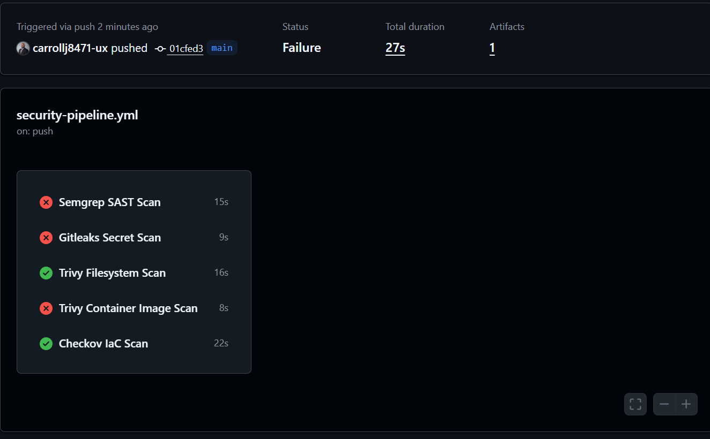
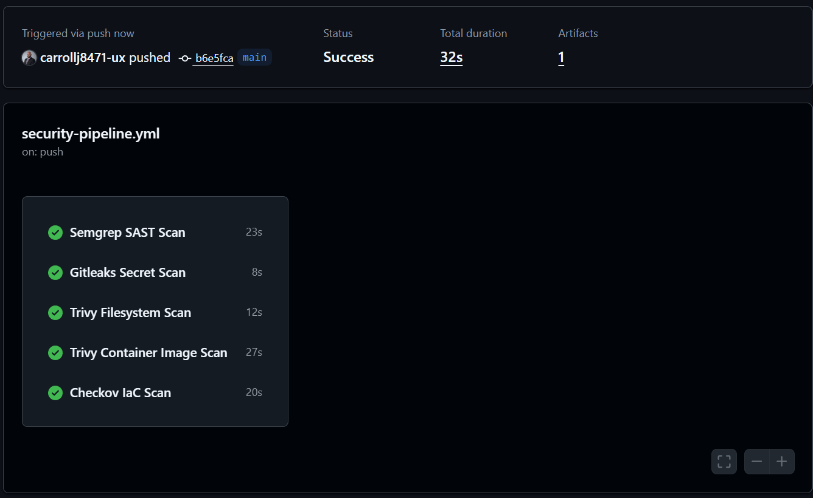

# DevSecOps Security Pipeline

## Overview

This project demonstrates a DevSecOps security pipeline built with GitHub Actions. The pipeline automatically scans application code, secrets, dependencies, container images, and Terraform infrastructure-as-code.

## Tools Used

- GitHub Actions
- Semgrep
- Gitleaks
- Trivy
- Checkov
- Docker
- Terraform
- Python Flask

## Skills Demonstrated

- CI/CD security automation
- Static application security testing
- Secret detection
- Container image scanning
- Infrastructure-as-code scanning
- Vulnerability remediation
- Security documentation

## Pipeline Jobs

| Job | Purpose |

|---|---|

| Semgrep SAST Scan | Scans source code for insecure code patterns |

| Gitleaks Secret Scan | Detects hardcoded secrets |

| Trivy Filesystem Scan | Scans project files and dependencies |

| Trivy Container Scan | Scans the Docker image |

| Checkov IaC Scan | Scans Terraform for cloud misconfigurations |

## Screenshots

### Initial Pipeline Run Before Remediation

The initial pipeline run showed security and build validation failures. This represented the first state of the project before remediation.

### Pipeline Run After Remediation

After fixing the workflow configuration, correcting the Dockerfile, and removing the demo secret, all DevSecOps pipeline jobs completed successfully.

## Security Findings Demonstrated

| Finding | Tool | Remediation |

|---|---|---|

| Demo secret detected | Gitleaks | Removed the fake secret from the repository |

| SSH open to the internet in Terraform | Checkov | Restricted SSH ingress to a private CIDR range |

| Dependency/container findings | Trivy | Reviewed vulnerability severity and remediation guidance |

## Lessons Learned

This project shows how DevSecOps pipelines help detect issues earlier in the development lifecycle. Automated scanning improves visibility, supports secure development, and provides repeatable evidence that security controls are working.

